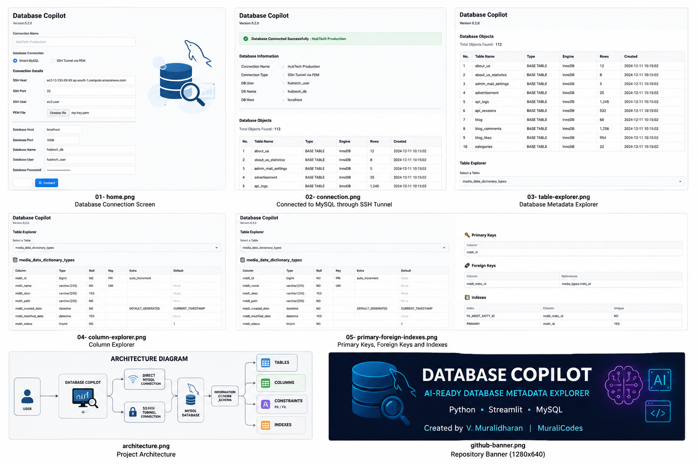

# 🗄️ Database Copilot


Database Copilot is an open-source Python application built with Streamlit that allows developers and database administrators to explore MySQL databases through both direct connections and secure SSH tunnels.

The project is designed as the foundation for an AI-powered Database Assistant capable of understanding database schemas, generating SQL, documenting databases and assisting developers.

---

# Features

## Database Connection

- Direct MySQL Connection
- SSH Tunnel Connection using PEM Key
- Secure Authentication

---

## Metadata Explorer

- Database Information
- Table Listing
- Table Engine
- Estimated Row Count
- Creation Date
- Column Details
- Primary Keys
- Foreign Keys
- Index Information

---

## Current Version

Version **0.2.0**

---

# Upcoming Features

- SQL Query Builder
- AI Prompt Builder
- Database Documentation Generator
- ER Diagram Generator
- Database Health Check
- Export Metadata to Excel
- Export Documentation to PDF
- OpenAI Integration
- Gemini Integration
- Claude Integration
- Ollama Integration
- PostgreSQL Support
- SQL Server Support
- Oracle Support

---

# Technology Stack

- Python
- Streamlit
- PyMySQL
- Paramiko
- SSHTunnel
- Pandas

---

# Project Structure

```
database-copilot/

│

├── ai/

├── config/

├── database/

├── models/

├── ui/

├── utils/

├── logs/

├── docs/

├── app.py

├── README.md

└── requirements.txt
```

---

# Installation

```
pip install -r requirements.txt

streamlit run app.py
```

---

# Screenshots

## 📸 Application Screenshots



---

# Roadmap

### Version 0.3

- Better Metadata Explorer
- Relationship Explorer
- Search Tables
- Search Columns

### Version 0.4

- AI Prompt Builder
- SQL Generator

### Version 0.5

- AI Database Copilot

---

# Author

## V. Muralidharan

Senior Database Developer
MySQL Specialist
AWS EC2 Administrator


LinkedIn
https://www.linkedin.com/in/dharanv/

GitHub
https://github.com/MuraliV1983/

---

# Contributing

Contributions, ideas and feature requests are welcome.

Feel free to fork the repository and submit Pull Requests.

---

# License

MIT License

Copyright (c) 2026 V. Muralidharan
